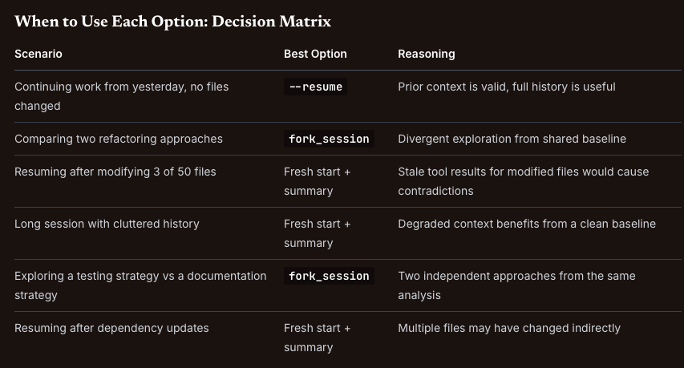

# Session State and Resumption

Session management **determines how an agent maintains continuity across work sessions**. 

In long-running tasks:   
— debugging a complex system. 
- reviewing a large codebase. 
- conducting multi-day research. 
— the agent's context accumulates tool results. 
- file analyses. 
- reasoning chains. 

## Three Session Management Options

The `Agent SDK` and `Claude Code` give you **three** approaches to session management. 
Each does a different job, and the exam expects you to pick the right one for the scenario in front of you.

### Option 1: --resume <session-name>

Resume **continues a specific named session from where it left off**.
**The entire conversation history** — including all tool results, analyses, and reasoning — **is restored**.

**When to use**: The prior context is mostly still valid. Files have not changed significantly since the last session. You want to pick up exactly where you stopped.

**When NOT to use**: Files have been modified since the last session. Tool results in the conversation history no longer reflect the current state of the codebase. This leads to the stale context problem (covered below).

#### HOW SESSIONS GET THEIR NAMES

`--resume` **only resumes sessions that already exist** — **it accepts** a `session ID` or `name`, or `opens an interactive picker`, but **it never creates a session**.
In the current CLI **you name a session** when you start it with` --name` / `-n` (or mid-session with `/rename`), then continue it later with claude `--resume` <name>. 
There's also `-c` / `--continue`, which **resumes the most recent conversation in the current directory** without naming anything.

### Option 2: fork_session 

`Fork` creates an **independent branch** from a shared analysis baseline. After the fork, each branch operates independently — changes in one branch do not affect the other, and **branches cannot see each other's results**.

- In the `SDK` you set it **beside** `resume`, **not instead of it**: `resume` **picks the session**, and `fork_session: true` **starts a new session from a copy of that history rather than appending** to it.  

- The `CLI` pairs `--fork-session` with `--resume` the **same way**.

**When to use**: You have completed an initial analysis and **want to explore divergent approaches** from that shared starting point. 
For example, after analysing a codebase, you fork to compare two refactoring strategies. 
Each fork builds on the same initial understanding but takes a different direction.

**When NOT to use**: You simply **want to continue the same line** of investigation. Fork is for divergence, not continuation. If you are not comparing alternatives, use resume.

### Option 3: Fresh start with summary injection

Start a **completely new session but inject a structured summary** of the prior session's findings into the initial context. 
The new session has no stale tool results — only the curated summary you provide.

**When to use**: Tool results from the prior session are stale (files have changed, APIs have been updated, dependencies have shifted). Context has degraded over a long session (too many irrelevant tool results cluttering the history). **You need a clean baseline with preserved knowledge**.

**When NOT to use**: The prior context is still valid and you want to maintain the full conversation history. In this case, resume is more efficient.

## KEY CONCEPT

Three session management options serve three distinct purposes:  
- `resume` for continuation. 
- `fork` for divergent exploration. 
- `fresh start with summary injection` for when prior tool results are stale.   

The exam tests your ability to select the right option for each scenario.

## The Stale Context Problem 

The stale context problem is the central concept of this task statement. 
**It occurs when an agent resumes a session after code modifications** and reasons from cached tool results that **no longer reflect the current state of files**.

**How it manifests**: A developer works with `Claude Code` to analyse a codebase. They **make changes** to 3 files **and resume the session**. Claude gives contradictory advice about those files — recommending changes that were already made, or referencing code that no longer exists — because it is reasoning from the old tool results still in its conversation history.

**Why it happens**: When you **resume** a session, the **entire conversation history is restored, including every tool result** from the previous session. If a **file was read during the previous session and has since been modified**, the old file contents are still in the conversation as a tool result. The model reasons from that stale data alongside any new data, leading to contradictions.

**The naive fix** (and why it is insufficient): Simply **resuming the session** and **asking the agent to re-read the modified files**. This is better than nothing, **but the stale tool results remain in the conversation history**. The model may still reference old information from earlier in the context, especially for tangential decisions that do not directly involve the modified files.

**The correct fix**: Start a `fresh session with a structured summary` of prior findings. Specify which files have changed so the agent can perform targeted re-analysis of those files. The **fresh session has no stale tool results**, and the **injected summary preserves the knowledge** from the prior session without the outdated data.

## Targeted Re-Analysis vs Full Re-Exploration 

When files have changed, the agent doesn't need to re-analyse the whole codebase. That's wasteful. Re-reading 50 files because 3 of them changed is time you don't get back.

The correct approach is `targeted re-analysis`: **inform the agent about the specific files that changed** and let it **re-analyse only those files**. 
**The summary from the prior session covers everything that has not changed**.

What targeted re-analysis looks like in practice:

1. Start a fresh session.  
2. Inject a `structured summary`: "Prior analysis found X, Y, and Z across the codebase. The following 3 files have been modified since: auth.ts, database.ts, and api-routes.ts."  
3. The agent re-reads and re-analyses only the 3 modified files.  
4. It combines the fresh analysis of changed files with the preserved summary of unchanged files.  

This is faster than full re-exploration and more reliable than resuming with stale context.

## When to Use Each Option: Decision Matrix 

## Practical Example: The Contradictory Advice Bug

A developer uses `Claude Code` to analyse a 50-file codebase over two days. On Day 1, they analyse the authentication module and identify three issues. Overnight, they fix all three issues by modifying auth.ts, session.ts, and middleware.ts.

On Day 2, they resume the session. Claude recommends fixing the three issues that were already fixed — because the old tool results showing the unfixed code are still in the conversation history. Worse, when asked about the current state of auth.ts, Claude gives contradictory answers: sometimes referencing the old code (from the stale tool result) and sometimes referencing the new code (from a fresh read).

The fix: start a fresh session with a summary. "Prior analysis identified three authentication issues in auth.ts, session.ts, and middleware.ts. All three have been fixed. Please re-analyse these three files to verify the fixes and check for any new issues introduced by the changes."

The fresh session has no stale tool results. The agent reads the current files, verifies the fixes, and provides consistent advice based on the actual current state.

## Exam Traps 

1. Suggesting `full re-exploration` of a 50-file codebase when only 3 files changed
Full re-exploration is wasteful. Inform the agent about the specific 3 files that changed for targeted re-analysis. The prior summary covers everything else.

2. Recommending `--resume` after files have been modified
Resuming preserves stale tool results in the conversation history. The agent may reason from outdated file contents, leading to contradictory advice. A fresh start with summary injection avoids this.

3. Confusing `fork_session` with `--resume`
`fork_session` starts a new session from a copy of the existing history, so the original is left as it was. `--resume` appends to the same session. Fork for divergence, resume for continuation. In the SDK `fork_session` is set beside resume, so the choice is append or branch, not one option or the other.

4. Using `fork_session` to handle stale context after file changes
`fork_session` branches from the existing session, which still contains stale tool results. The fork inherits the stale context. A fresh start with summary injection is the correct approach for stale data.