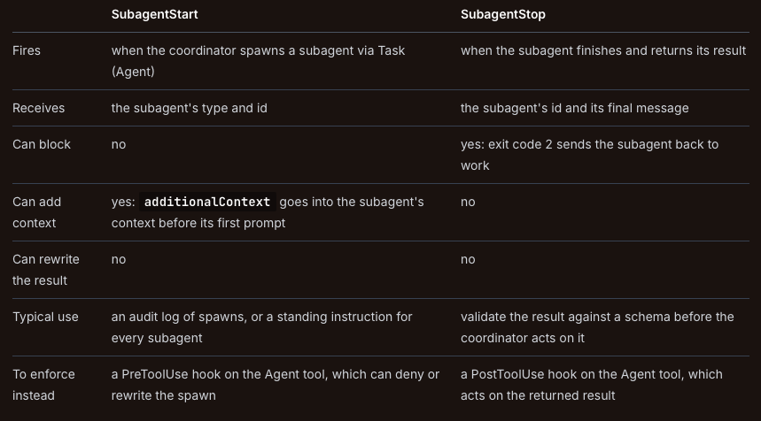

# Workflow Enforcement and Handoff

Task Statement draws a hard line between two approaches to controlling agent behaviour: 
1. prompt-based guidance 
2. programmatic enforcement

The exam tests this distinction repeatedly, and getting it wrong on high-stakes scenarios will cost you marks.

## The Enforcement Spectrum

There are two very different ways to enforce workflow ordering in an agentic system:

1. **Prompt-based guidance** means *putting instructions in the system prompt*. 
For example: "Always verify the customer's identity before processing a refund." 
It works most of the time — perhaps 90-95% of cases. 
But it carries a non-zero failure rate. 
The model is probabilistic. Sometimes it'll skip steps, reorder them, or read the instruction loosely. 
**For low-stakes operations, that failure rate is fine.**

2. **Programmatic enforcement** means *implementing hooks, prerequisite gates, or code-level checks that physically block downstream tools until prerequisites complete*.
For example: the `process_refund` tool cannot execute until `get_customer` has returned a verified customer ID. 
This works every time. It is deterministic, not probabilistic. No matter what the model decides to do, the gate prevents the wrong execution order.

## KEY CONCEPT

**Prompt-based guidance is probabilistic** — it works most of the time. 
**Programmatic enforcement is deterministic** — it works every time. 

The exam decision rule: if a single failure would cause **financial loss**, security breach, or compliance violation, use **programmatic enforcement**.

## The Exam Decision Rule

The exam applies a consistent decision rule across multiple scenarios:

1. **Financial operations** (refunds, transfers, payments): **programmatic enforcement**. 
A single unverified refund to the wrong account is a financial loss.

2. **Security operations** (identity verification, access control): **programmatic enforcement**. 
A single bypass of identity verification is a security breach.

3. **Compliance operations** (AML checks, regulatory requirements): **programmatic enforcement**. 
A single missed compliance check can result in legal penalties.

4. **Low-stakes operations** (formatting preferences, style guidelines, output ordering): **prompt-based guidance** is acceptable. 
A formatting inconsistency is not a business risk.

> The exam will present prompt-based solutions as answer options for high-stakes scenarios. Reject them. Enhanced system prompts, few-shot examples, and stronger instructions all improve accuracy but none provide deterministic guarantees. 

> When the scenario involves money, security, or compliance, the answer is always programmatic enforcement.

## Prerequisite Gates in Practice 

A prerequisite gate is a programmatic check that blocks a tool from executing until a prior condition is met. 
In a customer support agent:

1. The agent has access to `get_customer`, `lookup_order`, and `process_refund` tools.  

2. A prerequisite gate checks: has `get_customer` returned a verified customer ID for this session? 

3. If yes, `process_refund` executes normally. 

4. If no, `process_refund` returns an error message: "Cannot process refund — customer identity not verified. Please call get_customer first."

**The gate is code, not a prompt instruction**.
The model can't bypass it by deciding to skip verification. 
Even if the model attempts to call `process_refund` directly, the gate blocks the call and returns an error that forces the model to verify identity first.

## Subagent Lifecycle Hooks: SubagentStart and SubagentStop

The `Claude Agent SDK` provides lifecycle hook events (`PreToolUse` and `PostToolUse`) specifically for subagent management.

`SubagentStart` fires when a **subagent is spawned via** the Task **tool** (renamed Agent in current Claude Code). 
The hook receives the subagent's `type` and `id`, and it cannot block the spawn. 
What it can do is add context: return `additionalContext` in its JSON output and **that string is placed in the subagent's context before its first prompt**, which is the **documented way to hand a freshly spawned subagent a standing instruction**. 
To enforce rules on spawning itself — rate limits, or checking that the coordinator passed required context — attach a `PreToolUse` hook to the Agent tool instead, which can deny or rewrite the outgoing invocation before the subagent starts.

`SubagentStop` fires when a **subagent finishes execution and returns its results to the coordinator**. 
The hook receives the subagent's `id` and `final message`, so it can validate output and log completion for performance monitoring. 
If validation fails — say the output does not conform to the expected schema — the hook exits with `code 2`, which prevents the subagent from stopping and sends it back to keep working. 
Exit `code 2` is the documented blocking mechanism; there is no decision field for this event. 
`SubagentStop` does not transform the returned output, and the hooks reference documents no field on any event that rewrites a tool result in place, so treat output reshaping as something the coordinator does after the fact rather than something a hook does for you.



Both are configured like any other hook event, in `settings.json` or a `subagent's frontmatter`:
```json
{
  "hooks": {
    "SubagentStart": [
      { 
        "hooks": [{ 
          "type": "command",
          // Example appends a line. 
          // To add context instead, print JSON with an additionalContext field.
          "command": "echo \"subagent started $(date)\" >> .claude/spawns.log" 
        }]
      }
    ],
    "SubagentStop": [
      { 
        "hooks": [{ 
          "type": "command", 
          "command": ".claude/hooks/validate-subagent-output.sh" 
        }] 
      }
    ]
  }
}
```

**Subagent-scoped hooks**: 
Subagents can define their own hooks in their frontmatter. 
All hook events are supported there, including `PreToolUse` and `PostToolUse`, and they are scoped to the component's lifetime — they only intercept tool calls made by that specific subagent, not the coordinator or other subagents. 
This enables per-subagent policy enforcement (for example, a billing subagent might have a `PreToolUse` hook that blocks refunds above a threshold, while a technical support subagent has no such restriction).

**Stop hook auto-conversion**: 
When a subagent's frontmatter defines Stop hooks, these are automatically converted to `SubagentStop` events, because `SubagentStop` is the event that fires when a subagent completes. 
You can therefore define cleanup or validation logic in the subagent's own configuration and rely on it running at completion.

## KEY CONCEPT 

`SubagentStart` 
- observes subagent spawning
- can add context to the subagent
- cannot block it.

`SubagentStop`
- gates completion by exiting with `code 2` (which sends the subagent back to work) 

**Neither hook rewrites subagent output**.
Subagents **can define hooks in their own frontmatter**, scoped to their execution, and Stop hooks there auto-convert to `SubagentStop`.

## Multi-Concern Request Handling

Customers frequently submit requests with multiple issues: "I want to return my order, update my shipping address, and ask about my loyalty points." 
The exam tests how agents should handle these compound requests.

The **correct** approach:

1. **Decompose** the request into distinct items (`return`, `address update`, `loyalty inquiry`).

2. **Investigate each in parallel** using shared context (the customer's account information is relevant to all three). 

3. **Synthesise a unified resolution** that addresses all items in a single response.

The **wrong** approach 

Is to **handle them sequentially** with separate conversations, or to address **only the first item and forget the rest**.

## Structured Handoff Protocols 

When an agent **can't resolve an issue** and must escalate to a human agent, the handoff must follow a structured protocol. 
The **critical constraint**: the human agent does NOT have access to the conversation transcript. They can't scroll through the chat history to understand the issue.

A proper handoff summary must be self-contained and include:

- `Customer ID` — so the human agent can pull up the account.  
- `Conversation summary` — what the customer asked for and what has been attempted.  
- `Root cause analysis` — the agent's assessment of the underlying issue.  
- `Refund amount` (if applicable) — the specific financial figure, not a vague reference.  
- `Recommended action` — what the agent believes the human agent should do.  

This summary is the only information the human agent receives. If it is incomplete, the human agent must ask the customer to repeat everything, creating a poor experience.

## Practical Example: The 8% Failure Rate

Production data shows a customer support agent processes refunds without verifying account ownership in 8% of cases. 
The system prompt instructs: "Always verify the customer's identity before processing any refund." 
The prompt works 92% of the time but fails 8% of the time.

The 8% failure rate has already resulted in refunds processed on wrong accounts. 
This is a financial operation with real monetary consequences.

The **fix is a programmatic prerequisite gate**.
Before `process_refund` can execute, the system checks that `get_customer` has returned a verified customer ID in the current session. 
This eliminates the 8% failure rate entirely — not by improving the prompt, but by physically preventing the incorrect execution order.

## Exam Traps 

1. Enhanced system prompt instructions as the fix for high-stakes compliance failures.
If the current prompt already instructs the correct workflow but fails 8% of the time, a stronger prompt might reduce failures to 3-4% but will never reach 0%. Financial, security, and compliance operations **require programmatic enforcement** for deterministic guarantees.

2. Few-shot examples as sufficient for guaranteed compliance.
Few-shot examples improve model behaviour but are still probabilistic. They cannot provide the 100% enforcement required for financial and compliance operations. Use **programmatic prerequisite gates**.

3. Routing classifiers proposed to fix per-agent compliance issues.
A **routing classifier determines which agent handles a request**. The compliance failure occurs within the agent execution sequence, not at the routing level. Classifiers handle routing, not per-agent workflow enforcement.

4. Handoff summaries that omit critical fields like customer ID or recommended action.
Human agents do not have access to the conversation transcript. The handoff summary **must be self-contained with all required fields**: customer ID, conversation summary, root cause analysis, refund amount, and recommended action.
